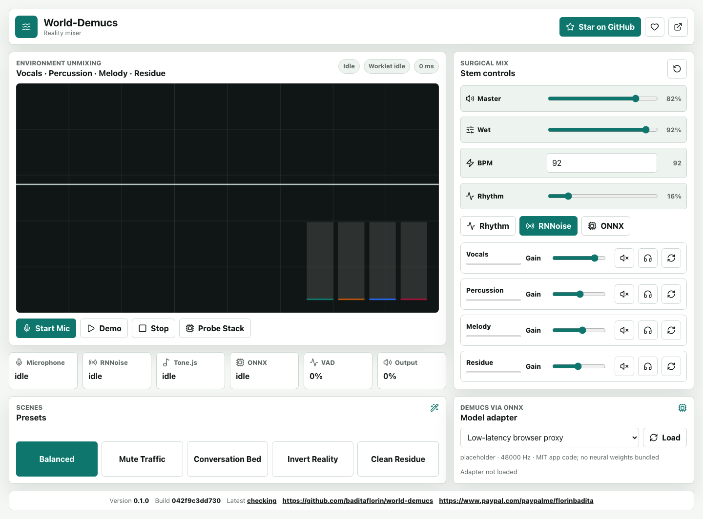
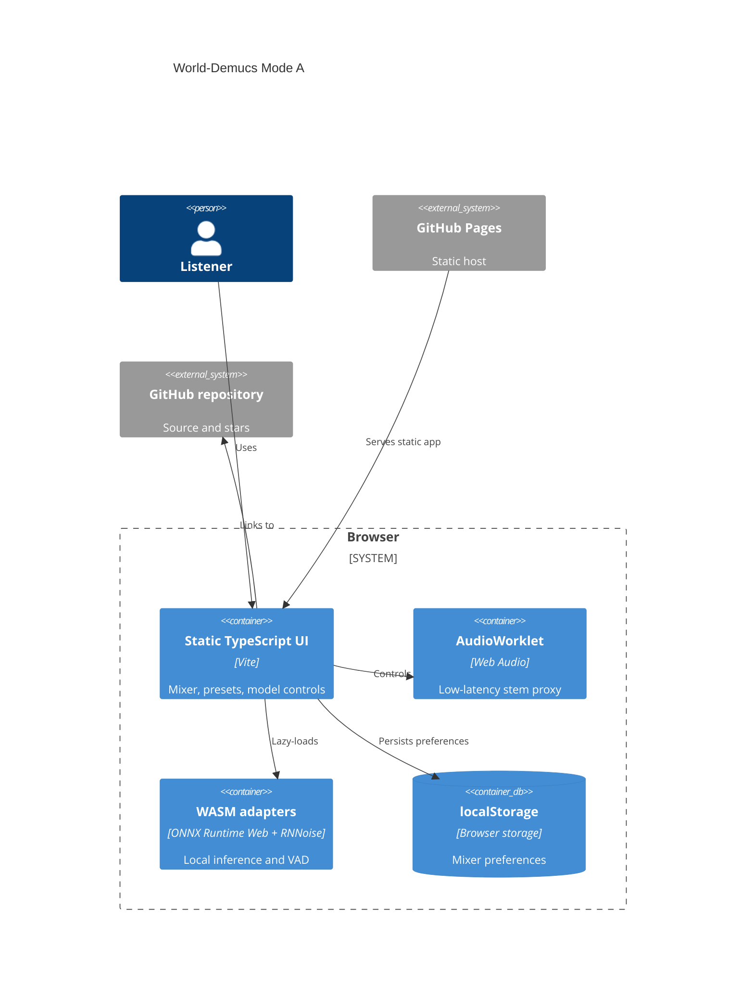

# World-Demucs


Real-time browser audio unmixing for vocals, percussion, melody, and ambient residue.

Live site: https://baditaflorin.github.io/world-demucs/

Repository: https://github.com/baditaflorin/world-demucs

Support: https://www.paypal.com/paypalme/florinbadita

World-Demucs is a local-only reality mixer: microphone audio enters the browser, runs through a Web Audio worklet, RNNoise VAD bias, Tone.js rhythm timing, and an ONNX Runtime Web adapter, then comes back out as controllable stems. No backend, no accounts, no uploaded audio.



## Quickstart

```bash
npm install
make dev
make test
make build
make smoke
```

## Architecture



More detail: docs/architecture.md

ADRs: docs/adr/

Deploy guide: docs/deploy.md

Privacy: docs/privacy.md

## Local Hooks

```bash
make install-hooks
```

The hooks run local checks only. There are no GitHub Actions.

## Notes

The app includes a browser-native proxy stem engine for immediate live use. The ONNX adapter is implemented and can probe compatible Demucs ONNX assets, but v1 does not bundle non-commercial neural weights into the MIT repository.
