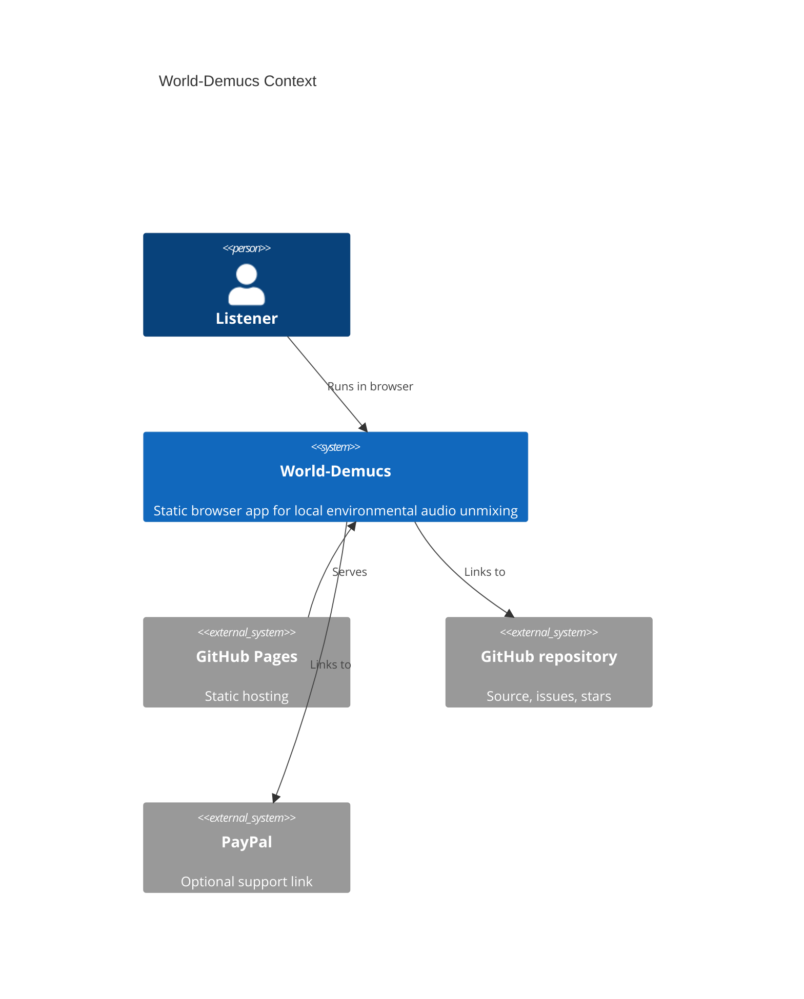
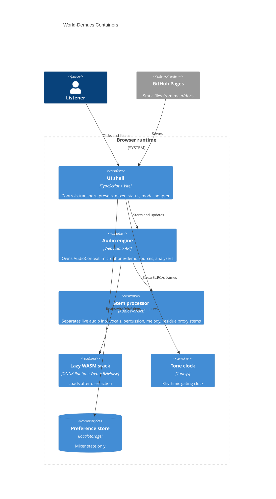

# Architecture

Live site: https://baditaflorin.github.io/world-demucs/

Repository: https://github.com/baditaflorin/world-demucs

## Context

## Containers

## Module Boundaries

`src/features/audio/` owns the mixer state, Web Audio lifecycle, manifest validation, lazy processing adapters, and visualizer.

`src/features/system/` owns build metadata and public GitHub commit lookup.

`public/worklets/` contains the real-time AudioWorklet processor served as a static asset.

`public/models/` contains the versioned model manifest contract.

`docs/` is the GitHub Pages publish directory and also stores ADRs and deployment docs.
